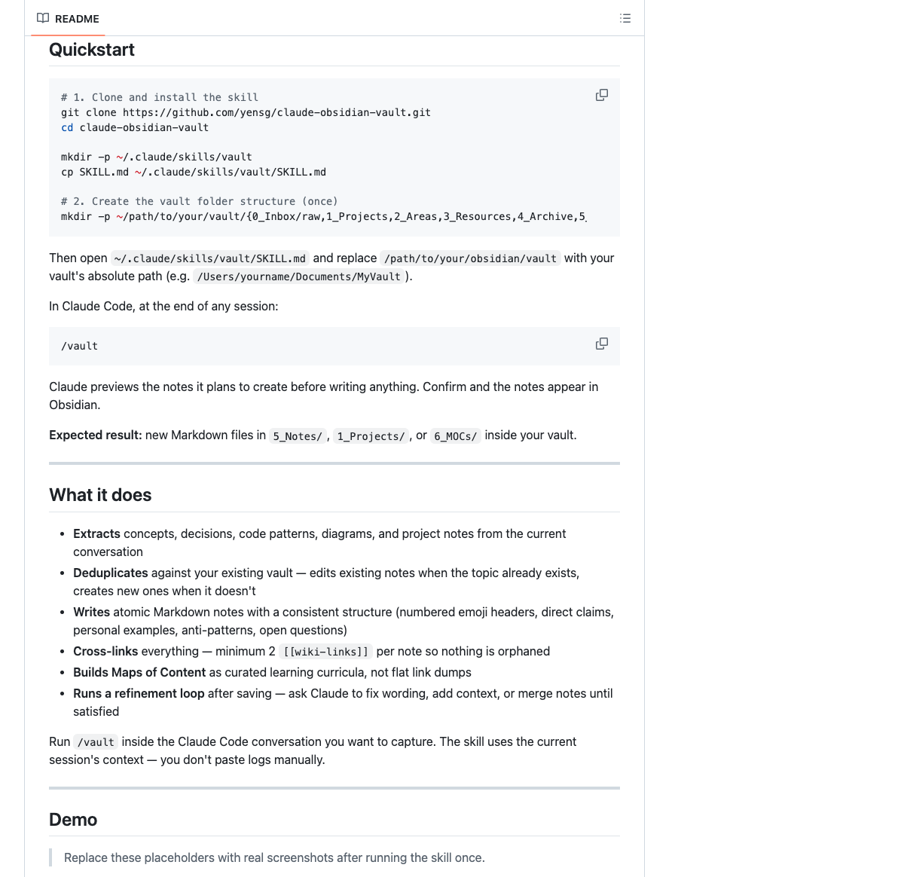
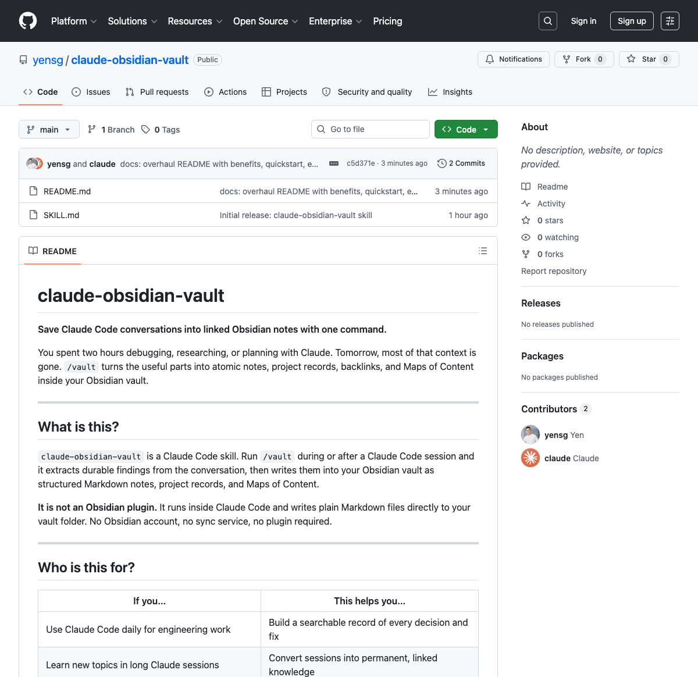
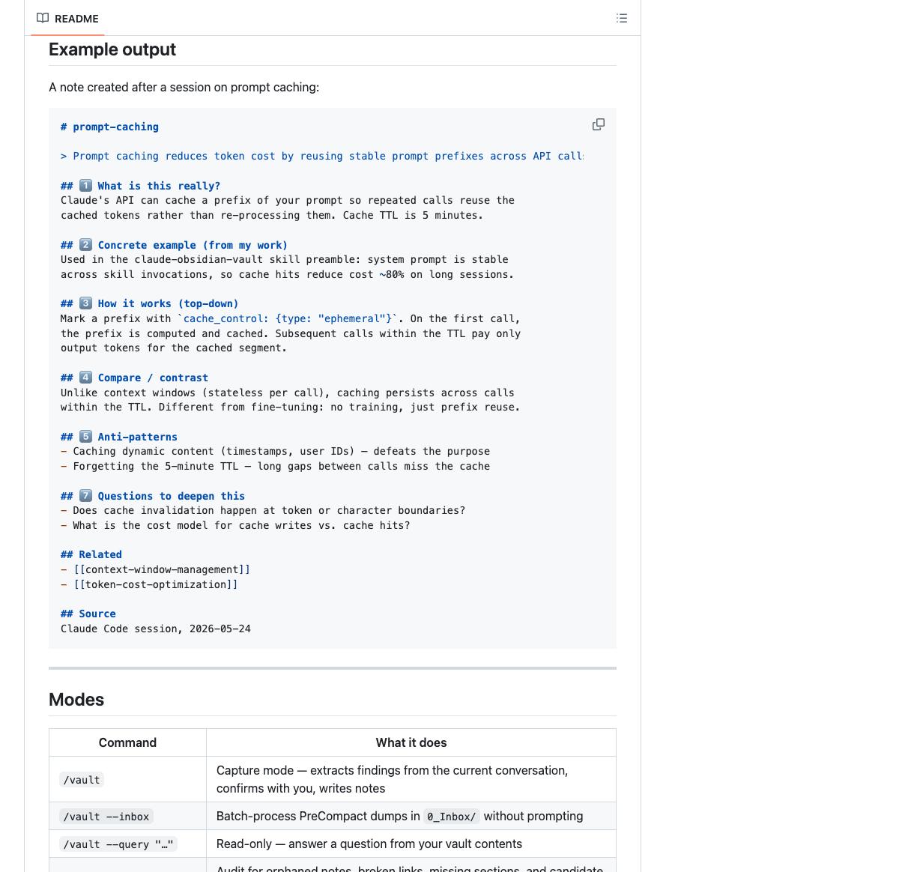
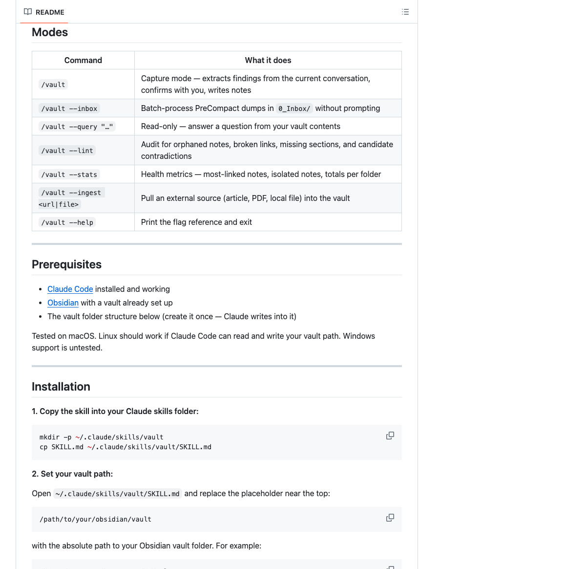

# claude-obsidian-vault

**Save Claude Code conversations into linked Obsidian notes with one command.**

You spent two hours debugging, researching, or planning with Claude. Tomorrow, most of that context is gone. `/vault` turns the useful parts into atomic notes, project records, backlinks, and Maps of Content inside your Obsidian vault.

---

## What is this?

`claude-obsidian-vault` is a Claude Code skill. Run `/vault` during or after a Claude Code session and it extracts durable findings from the conversation, then writes them into your Obsidian vault as structured Markdown notes, project records, and Maps of Content.

**It is not an Obsidian plugin.** It runs inside Claude Code and writes plain Markdown files directly to your vault folder. No Obsidian account, no sync service, no plugin required.

---

## Who is this for?

| If you… | This helps you… |
|---------|-----------------|
| Use Claude Code daily for engineering work | Build a searchable record of every decision and fix |
| Learn new topics in long Claude sessions | Convert sessions into permanent, linked knowledge |
| Struggle to remember what you figured out last week | Find it in seconds via `/vault --query` |
| Want an Obsidian graph that reflects your thinking | Grow it automatically, one session at a time |
| Have a vault full of orphaned notes | Let Claude wire them together with backlinks |

---

## Before and after

**Before:**
- Useful decisions buried in Claude Code chat history
- Project context lost when sessions get compacted
- Same problems re-researched from scratch

**After:**
- Durable Markdown notes in Obsidian, linked by concept
- Project decisions tied to the ideas behind them
- Queryable memory across sessions via `/vault --query`

---

## Quickstart

```bash
# 1. Clone and install the skill
git clone https://github.com/yensg/claude-obsidian-vault.git
cd claude-obsidian-vault

mkdir -p ~/.claude/skills/vault
cp SKILL.md ~/.claude/skills/vault/SKILL.md

# 2. Create the vault folder structure (once)
mkdir -p ~/path/to/your/vault/{0_Inbox/raw,1_Projects,2_Areas,3_Resources,4_Archive,5_Notes,6_MOCs,_meta/templates}
```

Then open `~/.claude/skills/vault/SKILL.md` and replace `/path/to/your/obsidian/vault` with your vault's absolute path (e.g. `/Users/yourname/Documents/MyVault`).

In Claude Code, at the end of any session:

```
/vault
```

Claude previews the notes it plans to create before writing anything. Confirm and the notes appear in Obsidian.

**Expected result:** new Markdown files in `5_Notes/`, `1_Projects/`, or `6_MOCs/` inside your vault.

---

## What it does

- **Extracts** concepts, decisions, code patterns, diagrams, and project notes from the current conversation
- **Deduplicates** against your existing vault — edits existing notes when the topic already exists, creates new ones when it doesn't
- **Writes** atomic Markdown notes with a consistent structure (numbered emoji headers, direct claims, personal examples, anti-patterns, open questions)
- **Cross-links** everything — minimum 2 `[[wiki-links]]` per note so nothing is orphaned
- **Builds Maps of Content** as curated learning curricula, not flat link dumps
- **Runs a refinement loop** after saving — ask Claude to fix wording, add context, or merge notes until satisfied

Run `/vault` inside the Claude Code conversation you want to capture. The skill uses the current session's context — you don't paste logs manually.

---

## Demo

> Replace these placeholders with real screenshots after running the skill once.

**1. Quickstart — install in 3 commands**


*Copy the skill file, set your vault path, and run `/vault` at the end of any session.*

**2. The project on GitHub**


*One file to install (`SKILL.md`). No dependencies, no Obsidian plugins, no account required.*

**3. Example note output**


*Every note follows the same 8-section template: claim, concrete example, anti-patterns, open questions, wiki-links.*

**4. All available commands**


*Seven modes: capture, batch inbox, query, lint, stats, ingest, and help.*

---

## Example output

A note created after a session on prompt caching:

```markdown
# prompt-caching

> Prompt caching reduces token cost by reusing stable prompt prefixes across API calls.

## 1️⃣ What is this really?
Claude's API can cache a prefix of your prompt so repeated calls reuse the
cached tokens rather than re-processing them. Cache TTL is 5 minutes.

## 2️⃣ Concrete example (from my work)
Used in the claude-obsidian-vault skill preamble: system prompt is stable
across skill invocations, so cache hits reduce cost ~80% on long sessions.

## 3️⃣ How it works (top-down)
Mark a prefix with `cache_control: {type: "ephemeral"}`. On the first call,
the prefix is computed and cached. Subsequent calls within the TTL pay only
output tokens for the cached segment.

## 4️⃣ Compare / contrast
Unlike context windows (stateless per call), caching persists across calls
within the TTL. Different from fine-tuning: no training, just prefix reuse.

## 5️⃣ Anti-patterns
- Caching dynamic content (timestamps, user IDs) — defeats the purpose
- Forgetting the 5-minute TTL — long gaps between calls miss the cache

## 7️⃣ Questions to deepen this
- Does cache invalidation happen at token or character boundaries?
- What is the cost model for cache writes vs. cache hits?

## Related
- [[context-window-management]]
- [[token-cost-optimization]]

## Source
Claude Code session, 2026-05-24
```

---

## Modes

| Command | What it does |
|---------|-------------|
| `/vault` | Capture mode — extracts findings from the current conversation, confirms with you, writes notes |
| `/vault --inbox` | Batch-process PreCompact dumps in `0_Inbox/` without prompting |
| `/vault --query "…"` | Read-only — answer a question from your vault contents |
| `/vault --lint` | Audit for orphaned notes, broken links, missing sections, and candidate contradictions |
| `/vault --stats` | Health metrics — most-linked notes, isolated notes, totals per folder |
| `/vault --ingest <url\|file>` | Pull an external source (article, PDF, local file) into the vault |
| `/vault --help` | Print the flag reference and exit |

---

## Prerequisites

- [Claude Code](https://claude.ai/code) installed and working
- [Obsidian](https://obsidian.md) with a vault already set up
- The vault folder structure below (create it once — Claude writes into it)

Tested on macOS. Linux should work if Claude Code can read and write your vault path. Windows support is untested.

---

## Installation

**1. Copy the skill into your Claude skills folder:**

```bash
mkdir -p ~/.claude/skills/vault
cp SKILL.md ~/.claude/skills/vault/SKILL.md
```

**2. Set your vault path:**

Open `~/.claude/skills/vault/SKILL.md` and replace the placeholder near the top:

```
/path/to/your/obsidian/vault
```

with the absolute path to your Obsidian vault folder. For example:

```
/Users/yourname/Documents/MyVault
```

**3. (Optional) Create the vault folder structure:**

```bash
mkdir -p ~/path/to/vault/{0_Inbox/raw,1_Projects,2_Areas,3_Resources,4_Archive,5_Notes,6_MOCs,_meta/templates}
```

---

## Vault folder structure

```
your-vault/
├── 0_Inbox/        # Incoming dumps; raw/ holds immutable source files
├── 1_Projects/     # Active project work (README + notes/ + decisions/)
├── 2_Areas/        # Ongoing responsibilities (flat, one file per area)
├── 3_Resources/    # Reference material: LeetCode/, Books/, Cheatsheets/
├── 4_Archive/      # Inactive items
├── 5_Notes/        # FLAT atomic Zettelkasten notes — no subfolders
├── 6_MOCs/         # Maps of Content + Home.md
└── _meta/          # Templates: concept.md, project.md, leetcode.md, moc.md
```

Note naming in `5_Notes/`: lowercase, hyphen-separated, no dates in filename. Date goes in frontmatter `created:` field.
Example: `rag-chunking.md`, `tool-calling.md`, `prompt-caching.md`

---

## The PARAZETTEL method

This skill uses a hybrid of three knowledge systems:

**PARA** (Tiago Forte) — the execution engine. Four folders: Projects (active), Areas (ongoing), Resources (reference), Archive (inactive). Everything has a home.

**Zettelkasten** (Niklas Luhmann) — the insight engine. Every idea gets its own atomic note, written to be self-contained and densely linked. Notes reference each other by concept, not by folder hierarchy.

**Maps of Content** (Nick Milo / LYT) — flexible curriculum hubs. Instead of rigid folder nesting, MOCs are notes that sequence links into a learning path. Updating a MOC forces you to decide how a new idea relates to what you already know.

**LLM-wiki pattern** (Andrej Karpathy) — Claude maintains the wiki. It writes summaries, adds backlinks, detects existing notes to update vs. create, and keeps the graph connected. You provide the raw conversation; Claude provides the synthesis.

---

## Note structure

Every concept note follows the same template:

```markdown
# Note title

> One-line direct claim about this concept.

## 1️⃣ What is this really?
## 2️⃣ Concrete example (from my work)
## 3️⃣ How it works (top-down)
## 4️⃣ Compare / contrast
## 5️⃣ Anti-patterns (what NOT to do)
## 6️⃣ Why I'm learning this
## 7️⃣ Questions to deepen this
## Related
## Refinements
## Source
```

**Confidence tagging** — claims are tagged inline where the distinction matters:
- `(extracted)` — the source stated this directly
- `(inferred)` — you introduced an analogy or extension not in the source
- `(ambiguous)` — the field has no consensus or sources conflict

---

## Safety

**Path safety gate** — every Write/Edit checks that the target path starts with your configured vault path and contains no `..` traversal. The skill instructs Claude to refuse writes outside your vault path before every write. If there is an actual conflict, it refuses and tells you.

**Optional PreToolUse hook** — for extra defense-in-depth, add a hook to `~/.claude/hooks/` that blocks any Write/Edit/Bash tool call whose path references a vault you want to protect. Useful if you have multiple Obsidian vaults.

See the [Claude Code hooks documentation](https://docs.anthropic.com/en/docs/claude-code/hooks) for setup.

---

## Privacy

The skill writes to your local Obsidian vault. It does not require an Obsidian account, Obsidian Sync, or any Obsidian plugin. All model-side processing follows your Claude Code environment and Anthropic account settings.

---

## Rename propagation

When you tell the skill something was renamed, it:
1. Greps the vault for the old name (word-boundary match, skips raw captures, templates, archive, and historical decision notes)
2. Shows you the full file list and match counts before touching anything
3. Applies replacements only after your explicit confirmation

---

## Companion: PreCompact dump hook

Claude Code can compact long conversations automatically. If you add a `dump-before-compact.sh` hook (fired on the `PreCompact` event), it snapshots the full conversation into `0_Inbox/precompact_<timestamp>.md` before compaction runs — so nothing is lost.

After a compaction, run `/vault --inbox` to process any pending dumps in one batch.

---

## Limitations

- Note quality depends on the quality of the conversation. Shallow sessions produce shallow notes.
- It may create near-duplicate notes if the same concept surfaces under different names in different sessions. Use `/vault --lint` to find and merge them.
- Optimised for the folder structure above. Using a different layout requires editing `SKILL.md`.
- External ingestion (`--ingest`) depends on what Claude Code can access in your environment (file permissions, network).
- It does not replace source-of-truth documentation for production systems.

---

## FAQ

**Is this an Obsidian plugin?**
No. It is a Claude Code skill that writes Markdown files into a folder that Obsidian reads.

**Can I use my existing vault?**
Yes. Add the expected folders once and the skill will write into them without touching your existing notes (unless it finds a note to update, which it previews first).

**Will it modify existing notes?**
Only when it detects that a topic already exists. It previews any planned edits before writing.

**Does it work without Obsidian?**
Technically yes — it writes plain Markdown files. Obsidian is the intended reader for backlinks and graph view.

**Can I change the note template?**
Yes. Edit the template instructions in `SKILL.md`.

**How does it know what to capture?**
Run `/vault` inside the Claude Code conversation you want to save. It uses the current session context — you don't paste logs manually.

---

## Repository contents

- `SKILL.md` — the Claude Code skill (this is the only file you need to install)
- `docs/screenshots/` — demo images
- `README.md` — setup and usage guide

---

## Contributing

Useful contributions:
- Installation improvements for Linux / Windows
- Hook examples for PreCompact and PreToolUse
- Better default note templates
- Tests against sample vaults
- Real screenshots and a terminal demo recording

---

## Roadmap

- One-command install script
- Sample vault fixture for testing
- Configurable folder layout
- Duplicate-note review mode
- Richer query citations with source links

---

## License

MIT
